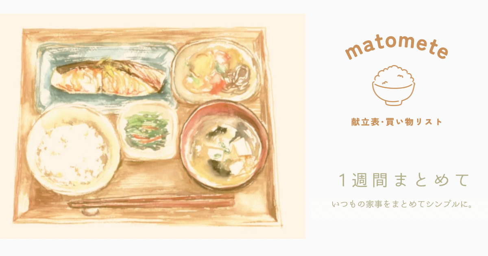
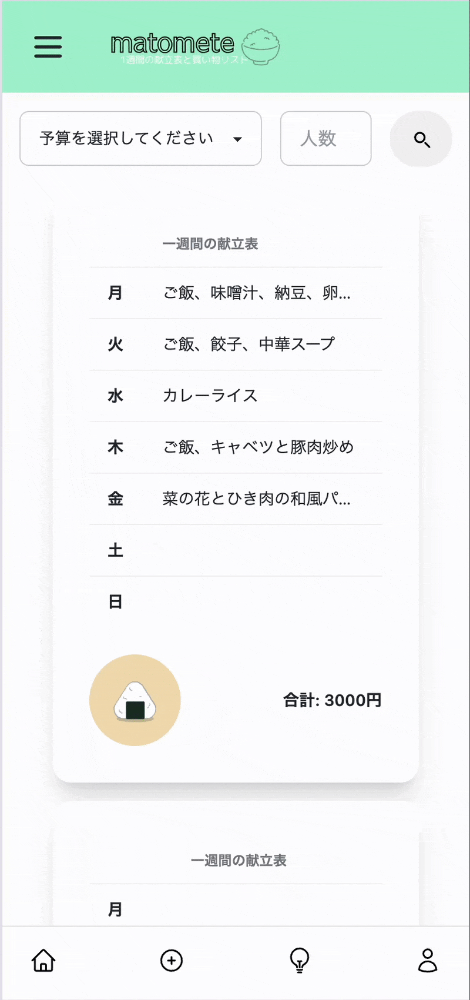
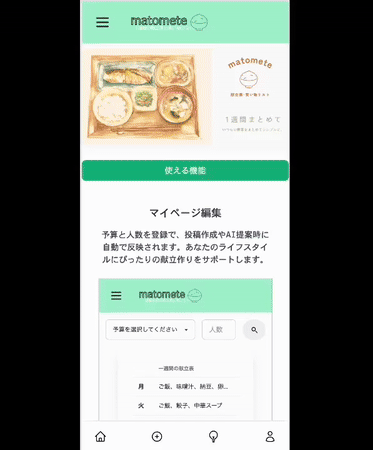
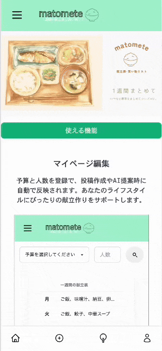
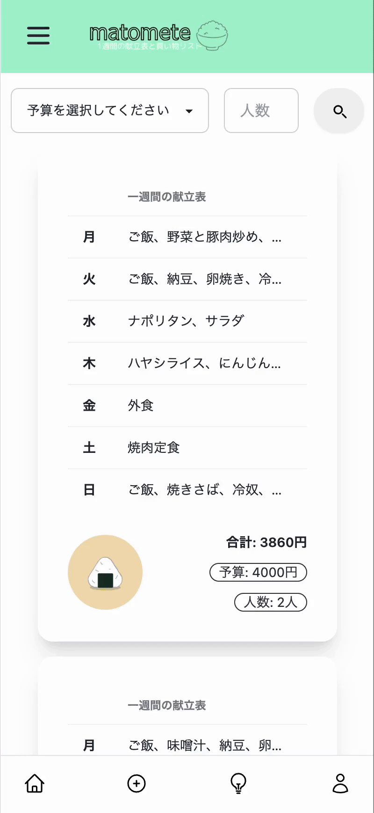
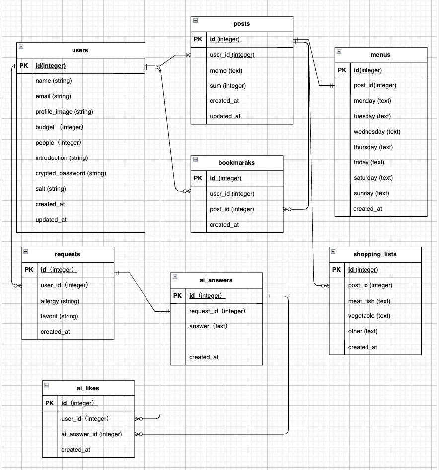

# プロジェクト名：「matomete」
   

# 目次
- [サービス概要](#-サービス概要)
- [サービスURL](#-サービスurl)
- [サービス開発の背景](#-サービス開発の背景)
- [ユーザー層について](#-ユーザー層について)
- [機能紹介](#-機能紹介)
- [技術構成について](#技術構成について)
  - [使用技術](#使用技術)
  - [ER図](#er図当初作成したもの)
  - [画面遷移図](#画面遷移図当初作成したもの) 
 

### ■ サービス概要

〜  献立と買い物リストを一週間まとめて  〜

「matomete」は一週間分の献立と予算、買い物リストを簡単に作成・共有できるアプリです。他の人の献立と買い物リストを参考にして食事の計画と買い物の手間を大幅に削減します。画像投稿をしないことでメモ感覚で投稿でき、まとめ買いすることで節約にも繋げられるプラットフォームです。

### ■ サービスURL
### https://matomete.jp 
 

### ■ サービス開発の背景

毎日の献立を考えることは、多くの人にとって大きな負担です。特に共働き家庭では、仕事と家事を両立させる中で「今日のごはん、何にしよう？」という悩みが日々のストレスになりがちです。

私自身も仕事と家事を両立させようと、時短を目指し買い物の回数を減らすためにまとめ買いを意識していましたが、参考になるサイトやサービスは少なく、「まとめ買いに特化した献立のアイデアが欲しい」と感じていました。

そのため、一週間分の献立と買い物リストを簡単にまとめて投稿・共有できるサービスを開発しました。さまざまな人の投稿を参考にすることで、日々の献立の悩みを減らし、食材の無駄を省いて節約にもつなげられると考えています。

さらに、「何を作るか」「どれだけ買うか」を毎回考える手間を減らすため、OpenAI APIを活用して、予算や人数に応じた献立と買い物リストを自動生成する機能を実装しました。

このサービスを通して、忙しい毎日の中でも、家事の負担を少しでも減らし、無理なく続けられる食生活を支えることを目指しています。

### ■ ユーザー層について

1. 家事時間を短縮したい共働き家庭： 時間の制約がある中で、献立とまとめ買いリストを参考にすることで、家事の負担を減らせるため。
2. 節約したい人: 限られた予算内で食事を工夫したい人に役立つため。

### ■ 機能紹介

| ユーザー登録 / マイページ |
|:---:|
|  |
| 
名前・メールアドレス・パスワードを入力、またはGoogleアカウントで新規登録ができます。 マイページで予算と人数を登録すると、投稿やAI献立生成時に自動で反映されます。
 |
 

| 投稿機能 |
|:---:|
|  |
| 
一週間分の献立と買い物リストをまとめて投稿できます。自身の投稿内容は後から編集・削除も可能です。
 |
 

| 検索機能 |
|:---:|
|  |
| 
自分の予算と人数に合わせて投稿を絞り込めます。効率的に献立を探したいときに便利です。
 |
 

| AI自動生成機能 |
|:---:|
|  |
| 
予算・人数・食材を入力すると、AIが理想的な献立を自動生成します。 マイページに登録済みの予算・人数は自動で反映されます。気に入った献立は保存も可能です。
 |
 

| お気に入り登録機能 |
|:---:|
|  |
| 
気に入った投稿や献立をお気に入りに保存して、いつでも簡単に見返せます。
 |
 

# 技術構成について

### ■ 使用技術

| カテゴリ | 技術内容 |
| --- | --- |
| サーバーサイド | Ruby on Rails 7.2.2.1・Ruby 3.3.6 |
| フロントエンド | JavaScript |
| CSSフレームワーク | Tailwindcss + daisyUI |
| Web API | OpenAI API|
| 認証 | Devise・Google OAuth |
| データベースサーバー | PostgreSQL |
| アプリケーションサーバー | Render |
| 環境構築 | Docker |
| CI/CD | Github Actions |
| バージョン管理ツール | GitHub・Git Flow |
 

### ■ ER図（当初作成したもの）

### ■ 画面遷移図（当初作成したもの）
https://www.figma.com/design/oGrHiBEpLJaUlhhFNlPPjB/Untitled?node-id=13-277&t=m2vdezFitizosjZ9-0